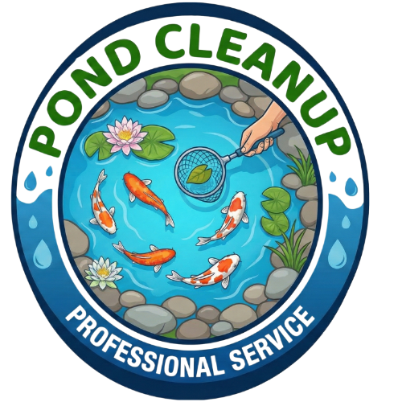

# Complete Build Guide: Pond Cleanup Website
## From Scratch to Deployment

**Date Created**: November 29, 2024  
**Project**: Pond Cleanup (pondcleanup.com)  
**Type**: Multi-page static website with 88+ pages  
**Technology Stack**: HTML5, CSS3, JavaScript (minimal), Vercel deployment

---

## Table of Contents

1. [Project Overview](#project-overview)
2. [Initial Setup](#initial-setup)
3. [File Structure](#file-structure)
4. [Step 1: Create Homepage](#step-1-create-homepage)
5. [Step 2: Create CSS Stylesheet](#step-2-create-css-stylesheet)
6. [Step 3: Create Main Pages](#step-3-create-main-pages)
7. [Step 4: Create Service Pages](#step-4-create-service-pages)
8. [Step 5: Create City Pages](#step-5-create-city-pages)
9. [Step 6: Set Up Images](#step-6-set-up-images)
10. [Step 7: SEO Implementation](#step-7-seo-implementation)
11. [Step 8: Testing & Verification](#step-8-testing--verification)
12. [Step 9: Deployment](#step-9-deployment)
13. [Prompts Used](#prompts-used)
14. [Troubleshooting](#troubleshooting)

---

## Project Overview

### What We're Building

A nationwide pond cleaning and maintenance service website with:
- **Homepage** with hero section, services, gallery, and testimonials
- **Service pages** (4 pages): Cleaning, Maintenance, Opening/Closing, Restoration
- **City pages** (69 pages): Major US cities for local SEO
- **Contractor pages** (2 profiles + directory)
- **Supporting pages**: About, FAQ, Contact, How It Works, Gallery, Locations, Book

### Goals
- Professional, modern design
- Mobile-responsive
- SEO-optimized
- Fast loading
- Easy to maintain

### Final Stats
- **88 total pages**
- **0 broken links**
- **All SEO optimized**
- **Google Analytics integrated**
- **Complete favicon set**

---

## Initial Setup

### Prerequisites

1. **Development Environment**
   - Text editor (VS Code, Cursor, etc.)
   - Node.js (for package management)
   - Git (for version control)
   - Web browser (for testing)

2. **Tools Needed**
   - Terminal/Command Prompt
   - Git Bash or PowerShell
   - Vercel CLI (for deployment)

### Create Project Directory

```bash
# Create project folder
mkdir pondcleanup
cd pondcleanup

# Initialize Git repository
git init

# Create initial folder structure
mkdir css
mkdir js
mkdir images
mkdir images/logo
mkdir pages
mkdir pages/services
mkdir pages/cities
mkdir pages/contractor
```

### Initialize Package Management

```bash
# Initialize npm
npm init -y

# Install Vercel CLI (optional, for deployment)
npm install -g vercel
```

---

## File Structure

### Final Directory Structure

```
pondcleanup/
├── index.html                          # Homepage
├── robots.txt                          # Search engine instructions
├── sitemap.xml                         # SEO sitemap
├── package.json                        # Node dependencies
├── README.md                           # Project documentation
├── SEO-SETUP.md                        # SEO documentation
├── verify-seo.ps1                      # SEO verification script
├── css/
│   └── styles.css                      # Main stylesheet
├── js/
│   └── search.js                       # Search functionality
├── images/
│   ├── logo/
│   │   ├── pondcleanuplogo.png        # Main logo
│   │   ├── favicon.ico                 # Browser favicon
│   │   ├── favicon-16x16.png
│   │   ├── favicon-32x32.png
│   │   ├── apple-touch-icon.png
│   │   ├── android-chrome-192x192.png
│   │   └── android-chrome-512x512.png
│   └── [700+ pond images]              # Gallery & page images
└── pages/
    ├── services.html                   # Services overview
    ├── gallery.html                    # Photo gallery
    ├── locations.html                  # Locations overview
    ├── how-it-works.html               # Process explanation
    ├── about.html                      # About page
    ├── faq.html                        # FAQ page
    ├── book.html                       # Booking form
    ├── contact.html                    # Contact page
    ├── find-a-contractor.html          # Contractor directory
    ├── for-contractors.html            # Contractor sign-up
    ├── services/
    │   ├── pond-cleaning.html
    │   ├── pond-maintenance.html
    │   ├── pond-opening-closing.html
    │   └── pond-restoration.html
    ├── contractor/
    │   ├── bluewater-pond-garden.html
    │   └── utah-water-gardens.html
    └── cities/
        ├── index.html                  # Cities directory
        ├── denver-co.html
        ├── austin-tx.html
        └── [67 more city pages]
```

---

## Step 1: Create Homepage

### Prompt Used:
```
"Create a professional homepage for a pond cleaning and maintenance service called 
'Pond Cleanup'. Include a hero section with a booking form, services overview, 
before/after gallery, testimonials, and footer. Make it modern and mobile-responsive."
```

### Key Sections to Include:

1. **Header with Navigation**
```html
<header class="site-header">
  <div class="container header-inner">
    <a href="/" class="logo">
      
    </a>
    <nav class="main-nav">
      <a href="pages/services.html">Services</a>
      <a href="pages/gallery.html">Gallery</a>
      <a href="pages/locations.html">Locations</a>
      <a href="pages/how-it-works.html">How It Works</a>
      <a href="pages/about.html">About</a>
      <a href="pages/book.html" class="btn btn-primary">Book a Cleaning</a>
    </nav>
  </div>
</header>
```

2. **Hero Section**
```html
<section class="hero">
  <div class="container hero-inner">
    <div class="hero-content">
      <h1>Nationwide Pond Cleaning & Maintenance</h1>
      <p>Professional pond cleaning, muck removal, and seasonal maintenance</p>
      <div class="hero-ctas">
        <a href="pages/book.html" class="btn btn-primary">Book a Pond Cleaning</a>
        <a href="pages/book.html" class="btn btn-secondary">Get a Free Quote</a>
      </div>
      <!-- Hero form here -->
    </div>
    <div class="hero-image">
      
    </div>
  </div>
</section>
```

3. **Services Grid**
4. **Why Choose Us Section**
5. **How It Works**
6. **Before & After Gallery**
7. **Testimonials**
8. **Bottom CTA**
9. **Footer**

### Meta Tags for SEO:

```html
<head>
  <!-- Google Analytics -->
  <script async src="https://www.googletagmanager.com/gtag/js?id=G-R7MX5CJ43F"></script>
  <script>
    window.dataLayer = window.dataLayer || [];
    function gtag(){dataLayer.push(arguments);}
    gtag('js', new Date());
    gtag('config', 'G-R7MX5CJ43F');
  </script>
  
  <meta charset="UTF-8" />
  <title>Pond Cleanup | Nationwide Pond Cleaning & Maintenance</title>
  <meta name="description" content="Professional pond cleaning, muck removal, and maintenance services nationwide." />
  <meta name="viewport" content="width=device-width, initial-scale=1.0" />
  <meta name="keywords" content="pond cleaning, pond maintenance, muck removal" />
  <meta name="robots" content="index, follow" />
  
  <!-- Open Graph -->
  <meta property="og:type" content="website" />
  <meta property="og:url" content="https://pondcleanup.com/" />
  <meta property="og:title" content="Pond Cleanup | Nationwide Pond Cleaning" />
  <meta property="og:description" content="Professional pond cleaning services" />
  
  <!-- Canonical URL -->
  <link rel="canonical" href="https://pondcleanup.com/" />
  
  <!-- Favicons -->
  <link rel="icon" type="image/x-icon" href="images/logo/favicon.ico" />
  <link rel="icon" type="image/png" sizes="16x16" href="images/logo/favicon-16x16.png" />
  <link rel="icon" type="image/png" sizes="32x32" href="images/logo/favicon-32x32.png" />
  
  <link rel="stylesheet" href="css/styles.css" />
</head>
```

---

## Step 2: Create CSS Stylesheet

### Prompt Used:
```
"Create a modern, professional CSS stylesheet for the pond cleaning website. 
Use CSS variables for colors, include mobile-responsive design with media queries, 
and make it visually appealing with smooth animations."
```

### Create `css/styles.css`:

#### 1. CSS Variables
```css
:root {
  /* Colors */
  --primary-blue: #0066cc;
  --primary-teal: #00a3a3;
  --dark-gray: #2c3e50;
  --light-gray: #f8f9fa;
  --text-dark: #333;
  --text-light: #666;
  
  /* Spacing */
  --spacing-sm: 0.5rem;
  --spacing-md: 1rem;
  --spacing-lg: 2rem;
  --spacing-xl: 4rem;
  
  /* Typography */
  --font-body: -apple-system, BlinkMacSystemFont, 'Segoe UI', sans-serif;
  --font-heading: 'Georgia', serif;
  
  /* Effects */
  --border-radius: 8px;
  --box-shadow: 0 2px 10px rgba(0,0,0,0.1);
  --transition: all 0.3s ease;
}
```

#### 2. Base Styles
```css
* {
  margin: 0;
  padding: 0;
  box-sizing: border-box;
}

body {
  font-family: var(--font-body);
  color: var(--text-dark);
  line-height: 1.6;
}

.container {
  max-width: 1200px;
  margin: 0 auto;
  padding: 0 var(--spacing-md);
}
```

#### 3. Component Styles
- Header & Navigation
- Buttons
- Cards
- Forms
- Grid layouts
- Hero sections
- Footer

#### 4. Responsive Design
```css
/* Mobile-first approach */
@media (min-width: 768px) {
  /* Tablet styles */
}

@media (min-width: 1024px) {
  /* Desktop styles */
}
```

---

## Step 3: Create Main Pages

### Pages to Create:

1. **Services Page** (`pages/services.html`)
2. **Gallery Page** (`pages/gallery.html`)
3. **Locations Page** (`pages/locations.html`)
4. **How It Works** (`pages/how-it-works.html`)
5. **About Page** (`pages/about.html`)
6. **FAQ Page** (`pages/faq.html`)
7. **Book/Quote Page** (`pages/book.html`)
8. **Contact Page** (`pages/contact.html`)
9. **Find a Contractor** (`pages/find-a-contractor.html`)
10. **For Contractors** (`pages/for-contractors.html`)

### Template for Each Page:

```html
<!DOCTYPE html>
<html lang="en">
<head>
  <!-- Google Analytics (same for all pages) -->
  <meta charset="UTF-8" />
  <title>[Page Title] | Pond Cleanup</title>
  <meta name="description" content="[Unique description]" />
  <meta name="viewport" content="width=device-width, initial-scale=1.0" />
  <link rel="canonical" href="https://pondcleanup.com/pages/[page-name]" />
  
  <!-- Favicons (same for all pages) -->
  <link rel="icon" type="image/x-icon" href="../images/logo/favicon.ico" />
  
  <link rel="stylesheet" href="../css/styles.css" />
</head>
<body>
  <!-- Header (consistent across all pages) -->
  <header class="site-header">...</header>
  
  <!-- Main content (unique for each page) -->
  <main>
    <section class="page-hero">
      <h1>[Page Title]</h1>
      <p>[Page description]</p>
    </section>
    
    <!-- Page-specific content -->
  </main>
  
  <!-- Footer (consistent across all pages) -->
  <footer class="site-footer">...</footer>
</body>
</html>
```

### Prompt for Each Page:
```
"Create a [PAGE NAME] page for the pond cleaning website. Include [specific content]. 
Make it consistent with the homepage design and include proper SEO meta tags."
```

---

## Step 4: Create Service Pages

### Four Service Pages:

1. **Pond Cleaning** (`pages/services/pond-cleaning.html`)
2. **Pond Maintenance** (`pages/services/pond-maintenance.html`)
3. **Pond Opening & Closing** (`pages/services/pond-opening-closing.html`)
4. **Pond Restoration** (`pages/services/pond-restoration.html`)

### Prompt Used:
```
"Create a service page for [SERVICE NAME]. Include what's included, pricing info, 
process steps, FAQ section, and a CTA to book. Use proper heading hierarchy 
and include before/after images."
```

### Each Service Page Should Include:

1. **Hero Section** with service title
2. **What's Included** section
3. **Process/How It Works**
4. **Pricing Information** (if applicable)
5. **Before & After Examples**
6. **FAQ** specific to the service
7. **CTA to Book**
8. **Related Services**

### Path Structure:
```
Note: Use relative paths from services subfolder
Stylesheet: ../../css/styles.css
Images: ../../images/[filename]
Logo: ../../images/logo/pondcleanuplogo.png
```

---

## Step 5: Create City Pages

### Overview

Created **69 city pages** for local SEO targeting major US cities.

### Automated Creation Process:

#### Prompt Used:
```
"Create a PowerShell script to generate city pages for major US cities. 
Each page should have the same structure but with city-specific information. 
Include city name, state, and a list of top pond service providers."
```

#### Create `create-cities.ps1`:

```powershell
# Define cities (city name, state abbreviation)
$cities = @(
    @{Name="Denver"; State="CO"},
    @{Name="Austin"; State="TX"},
    @{Name="Miami"; State="FL"},
    # ... 66 more cities
)

# Template for each city page
$template = @"
<!DOCTYPE html>
<html lang="en">
<head>
  <!-- Google Analytics -->
  <script async src="https://www.googletagmanager.com/gtag/js?id=G-R7MX5CJ43F"></script>
  <script>
    window.dataLayer = window.dataLayer || [];
    function gtag(){dataLayer.push(arguments);}
    gtag('js', new Date());
    gtag('config', 'G-R7MX5CJ43F');
  </script>
  <meta charset="UTF-8" />
  <title>Pond Services in {CITY}, {STATE} | Pond Cleanup</title>
  <meta name="description" content="Find top pond service providers in {CITY}, {STATE_FULL}." />
  <meta name="viewport" content="width=device-width, initial-scale=1.0" />
  <link rel="canonical" href="https://pondcleanup.com/pages/cities/{FILENAME}" />
  <link rel="icon" type="image/x-icon" href="../../images/logo/favicon.ico" />
  <link rel="stylesheet" href="../../css/styles.css" />
</head>
<body>
  <!-- Content specific to {CITY} -->
</body>
</html>
"@

# Generate each city page
foreach ($city in $cities) {
    $filename = "$($city.Name.ToLower() -replace ' ','-')-$($city.State.ToLower()).html"
    $content = $template -replace '{CITY}', $city.Name
    $content = $content -replace '{STATE}', $city.State
    $content = $content -replace '{FILENAME}', $filename
    
    Set-Content -Path "pages/cities/$filename" -Value $content
}
```

#### Run the script:
```powershell
.\create-cities.ps1
```

### City Page Structure:

Each city page includes:
1. **City-specific title and meta description**
2. **Hero section** with city name
3. **Top 10 pond service websites** for that city
4. **Local SEO content**
5. **Links back to main services**

### Cities Included (69 total):

- New York, NY
- Los Angeles, CA
- Chicago, IL
- Houston, TX
- Phoenix, AZ
- Philadelphia, PA
- San Antonio, TX
- San Diego, CA
- Dallas, TX
- San Jose, CA
- Austin, TX
- Jacksonville, FL
- Fort Worth, TX
- Columbus, OH
- Charlotte, NC
- San Francisco, CA
- Indianapolis, IN
- Seattle, WA
- Denver, CO
- Washington, DC
- Boston, MA
- [... and 48 more]

---

## Step 6: Set Up Images

### Image Organization:

```
images/
├── logo/
│   ├── pondcleanuplogo.png          # Main logo (1000x300px)
│   ├── favicon.ico                   # 16x16, 32x32, 48x48
│   ├── favicon-16x16.png
│   ├── favicon-32x32.png
│   ├── apple-touch-icon.png          # 180x180
│   ├── android-chrome-192x192.png
│   └── android-chrome-512x512.png
└── [pond photos]                     # Various sizes
```

### Favicon Generation:

#### Prompt Used:
```
"I need to create a complete favicon set for my pond cleaning website. 
How do I generate all the required sizes?"
```

#### Process:
1. Create or obtain main logo PNG (at least 512x512px)
2. Use online tool (favicon.io or similar)
3. Generate all required sizes
4. Place in `images/logo/` directory

#### Favicon HTML (in all pages):
```html
<link rel="icon" type="image/x-icon" href="../images/logo/favicon.ico" />
<link rel="icon" type="image/png" sizes="16x16" href="../images/logo/favicon-16x16.png" />
<link rel="icon" type="image/png" sizes="32x32" href="../images/logo/favicon-32x32.png" />
<link rel="apple-touch-icon" sizes="180x180" href="../images/logo/apple-touch-icon.png" />
<link rel="icon" type="image/png" sizes="192x192" href="../images/logo/android-chrome-192x192.png" />
<link rel="icon" type="image/png" sizes="512x512" href="../images/logo/android-chrome-512x512.png" />
```

### Content Images:

- Pond photos (before/after, services, gallery)
- Background images
- Service icons
- Testimonial avatars

---

## Step 7: SEO Implementation

### A. Create Sitemap.xml

#### Prompt Used:
```
"Create an XML sitemap for my website that includes all 88 pages. 
Use proper priorities and change frequencies for SEO."
```

#### Create `sitemap.xml`:

```xml
<?xml version="1.0" encoding="UTF-8"?>
<urlset xmlns="http://www.sitemaps.org/schemas/sitemap/0.9">
  <!-- Homepage -->
  <url>
    <loc>https://pondcleanup.com/</loc>
    <lastmod>2024-11-29</lastmod>
    <changefreq>weekly</changefreq>
    <priority>1.0</priority>
  </url>
  
  <!-- Main Pages (priority 0.9) -->
  <url>
    <loc>https://pondcleanup.com/pages/services.html</loc>
    <lastmod>2024-11-29</lastmod>
    <changefreq>monthly</changefreq>
    <priority>0.9</priority>
  </url>
  
  <!-- Service Pages (priority 0.8) -->
  <!-- City Pages (priority 0.7) -->
  <!-- ... all 88 pages -->
</urlset>
```

### B. Create Robots.txt

#### Create `robots.txt`:

```
User-agent: *
Allow: /

# Sitemap
Sitemap: https://pondcleanup.com/sitemap.xml

# Disallow admin and private areas
Disallow: /admin/
Disallow: /private/
Disallow: /temp/

# Allow all city pages
Allow: /pages/cities/
Allow: /pages/contractor/
```

### C. Implement Structured Data

#### Homepage Structured Data:

```html
<script type="application/ld+json">
{
  "@context": "https://schema.org",
  "@type": "WebSite",
  "name": "Pond Cleanup",
  "url": "https://pondcleanup.com",
  "description": "Nationwide pond cleaning and maintenance service",
  "potentialAction": {
    "@type": "SearchAction",
    "target": "https://pondcleanup.com/book?location={search_term_string}",
    "query-input": "required name=search_term_string"
  }
}
</script>

<script type="application/ld+json">
{
  "@context": "https://schema.org",
  "@type": "Organization",
  "name": "Pond Cleanup",
  "url": "https://pondcleanup.com",
  "logo": "https://pondcleanup.com/images/logo/pondcleanuplogo.png",
  "contactPoint": {
    "@type": "ContactPoint",
    "contactType": "Customer Service",
    "email": "info@pondcleanup.com"
  }
}
</script>
```

### D. Google Analytics Setup

#### Prompt Used:
```
"Add Google Analytics tracking to all pages of my website. 
Use Google Analytics 4 (GA4) format."
```

#### Add to every page (in `<head>`):

```html
<!-- Google tag (gtag.js) -->
<script async src="https://www.googletagmanager.com/gtag/js?id=G-R7MX5CJ43F"></script>
<script>
  window.dataLayer = window.dataLayer || [];
  function gtag(){dataLayer.push(arguments);}
  gtag('js', new Date());
  gtag('config', 'G-R7MX5CJ43F');
</script>
```

### E. Create SEO Verification Script

#### Prompt Used:
```
"Create a PowerShell script to verify all pages have proper SEO elements: 
canonical URLs, meta descriptions, titles, favicons, and Google Analytics."
```

#### Create `verify-seo.ps1`:

```powershell
# SEO Verification Script
Write-Host "=== SEO Verification ===" -ForegroundColor Cyan

$htmlFiles = Get-ChildItem -Path . -Include *.html -Recurse -File
$issues = @()

foreach ($file in $htmlFiles) {
    $content = Get-Content $file.FullName -Raw
    
    # Check for canonical URL
    if ($content -notmatch '<link rel="canonical"') {
        $issues += "$($file.Name): Missing canonical URL"
    }
    
    # Check for meta title
    if ($content -notmatch '<title>') {
        $issues += "$($file.Name): Missing title tag"
    }
    
    # Check for meta description
    if ($content -notmatch '<meta name="description"') {
        $issues += "$($file.Name): Missing meta description"
    }
    
    # Check for Google Analytics
    if ($content -notmatch 'gtag\(') {
        $issues += "$($file.Name): Missing Google Analytics"
    }
}

if ($issues.Count -eq 0) {
    Write-Host "✅ All SEO checks passed!" -ForegroundColor Green
} else {
    Write-Host "❌ Issues found:" -ForegroundColor Red
    $issues | ForEach-Object { Write-Host "  $_" }
}
```

---

## Step 8: Testing & Verification

### A. Check for 404 Errors

#### Prompt Used:
```
"Create a PowerShell script to scan all HTML files and check for broken 
internal links (404 errors) including images, stylesheets, and navigation links."
```

#### Testing Process:

1. **Create link checker script** (similar to verify-seo.ps1)
2. **Run the script**: `.\check-404s.ps1`
3. **Fix any broken links found**
4. **Verify all images load**
5. **Test all navigation links**

### B. Manual Testing Checklist:

- [ ] Homepage loads correctly
- [ ] All navigation links work
- [ ] Mobile responsive design works
- [ ] Forms function properly
- [ ] Images display correctly
- [ ] Logo appears on all pages
- [ ] Footer links work
- [ ] Service pages accessible
- [ ] City pages load
- [ ] Search functionality works
- [ ] Book/Contact forms work

### C. SEO Verification:

```powershell
# Run SEO verification
.\verify-seo.ps1

# Expected output: All checks passed
```

### D. Performance Testing:

- Test page load speed
- Check mobile responsiveness
- Verify cross-browser compatibility
- Test on different devices

---

## Step 9: Deployment

### A. Prepare for Deployment

#### Prompt Used:
```
"I need to deploy my static website to Vercel. Walk me through the process 
step by step."
```

#### Pre-deployment Checklist:

- [ ] All files committed to Git
- [ ] No broken links (404s)
- [ ] SEO elements in place
- [ ] Analytics configured
- [ ] Sitemap created
- [ ] Robots.txt in place
- [ ] All images optimized

### B. Git Setup

```bash
# Initialize git (if not already done)
git init

# Add all files
git add .

# Commit
git commit -m "Initial commit - Complete pond cleanup website"

# Create GitHub repository (via GitHub web interface)
# Then link local to remote:
git remote add origin https://github.com/[username]/pondcleanup.git
git branch -M main
git push -u origin main
```

### C. Deploy to Vercel

#### Option 1: Vercel CLI

```bash
# Install Vercel CLI globally
npm install -g vercel

# Login to Vercel
vercel login

# Deploy to production
vercel --prod

# Follow the prompts to configure your project
```

#### Option 2: Vercel Web Interface

1. Go to https://vercel.com
2. Click "New Project"
3. Import your Git repository
4. Configure project settings:
   - Framework Preset: Other
   - Root Directory: ./
   - Build Command: (none for static site)
   - Output Directory: ./
5. Click "Deploy"

### D. Custom Domain Setup

1. In Vercel dashboard, go to Project Settings
2. Navigate to "Domains"
3. Add your custom domain: `pondcleanup.com`
4. Follow DNS configuration instructions
5. Wait for DNS propagation (5 minutes to 48 hours)

### E. Post-Deployment Verification:

```bash
# Test live site
curl -I https://pondcleanup.com

# Verify sitemap is accessible
curl https://pondcleanup.com/sitemap.xml

# Verify robots.txt
curl https://pondcleanup.com/robots.txt
```

---

## Prompts Used

### Comprehensive List of All Prompts:

#### 1. Project Initialization
```
"Create a professional pond cleaning and maintenance website. I need a modern, 
responsive design with multiple pages including services, city pages for SEO, 
and booking functionality."
```

#### 2. Homepage Creation
```
"Create a professional homepage for 'Pond Cleanup' - a nationwide pond cleaning 
service. Include hero section, services grid, before/after gallery, testimonials, 
and booking form. Make it modern and mobile-responsive."
```

#### 3. CSS Styling
```
"Create a modern CSS stylesheet for the pond cleaning website. Use CSS variables, 
include mobile-responsive design, smooth animations, and professional color scheme."
```

#### 4. Service Pages
```
"Create a service page for pond cleaning that includes what's included, pricing, 
process steps, FAQ, and CTA. Use proper SEO structure."
```

#### 5. City Pages Generation
```
"Create a PowerShell script to generate 69 city pages for major US cities. 
Each page should have city-specific content for local SEO but follow the same template."
```

#### 6. SEO Setup
```
"Set up complete SEO for my website including sitemap.xml with all 88 pages, 
robots.txt, canonical URLs, meta tags, and Google Analytics."
```

#### 7. Image Optimization
```
"Generate a complete favicon set for my pond cleaning website including all 
required sizes for different platforms."
```

#### 8. Testing
```
"Create a PowerShell script to scan all HTML files for broken links (404 errors) 
including href, src, and background images."
```

#### 9. Verification
```
"Create a verification script to check that all pages have proper SEO elements: 
canonical URLs, meta descriptions, titles, and analytics."
```

#### 10. Deployment
```
"Deploy my static website to Vercel with a custom domain. Walk me through the 
complete process."
```

#### 11. 404 Error Fixes
```
"Scan the codebase for any 404 errors and fix all broken links."
```

#### 12. Documentation
```
"Create comprehensive documentation for the SEO setup including what was 
implemented and next steps for search engine submission."
```

---

## Troubleshooting

### Common Issues and Solutions:

#### 1. Broken Image Links

**Problem**: Images not displaying  
**Solution**: 
```powershell
# Check image paths
# City pages use: ../../images/[filename]
# Main pages use: ../images/[filename]
# Homepage uses: images/[filename]
```

#### 2. Wrong Logo Path

**Problem**: Logo showing as broken image  
**Solution**:
```
Correct path: images/logo/pondcleanuplogo.png
NOT: images/logo.png
```

#### 3. 404 on City Pages

**Problem**: City pages returning 404  
**Solution**: Verify files are in `pages/cities/` directory with correct naming:
```
Format: [city-name]-[state].html
Example: denver-co.html, new-york-ny.html
```

#### 4. SEO Issues

**Problem**: Missing canonical URLs  
**Solution**: Run verification script
```powershell
.\verify-seo.ps1
```

#### 5. Domain Name Inconsistency

**Problem**: Some pages reference wrong domain  
**Solution**: Search and replace all instances
```powershell
# Find all references
Get-ChildItem -Recurse -Include *.html | Select-String "old-domain.com"

# Replace with correct domain
(Get-Content $file) -replace 'old-domain.com', 'pondcleanup.com' | Set-Content $file
```

#### 6. Sitemap Not Found

**Problem**: Sitemap returns 404  
**Solution**: Ensure `sitemap.xml` is in root directory and accessible at:
```
https://pondcleanup.com/sitemap.xml
```

#### 7. Deployment Issues

**Problem**: Vercel deployment fails  
**Solution**: 
- Check package.json exists
- Verify no build errors locally
- Check Vercel build logs
- Ensure all files are committed to Git

---

## Next Steps After Deployment

### 1. Submit to Search Engines

#### Google Search Console:
```
1. Go to https://search.google.com/search-console
2. Add property: pondcleanup.com
3. Verify ownership (DNS method recommended)
4. Submit sitemap: https://pondcleanup.com/sitemap.xml
5. Request indexing for key pages
```

#### Bing Webmaster Tools:
```
1. Go to https://www.bing.com/webmasters
2. Add site
3. Verify ownership
4. Submit sitemap: https://pondcleanup.com/sitemap.xml
```

### 2. Monitor Performance

- Set up Google Analytics alerts
- Monitor Search Console for errors
- Check page speed insights weekly
- Review broken link reports

### 3. Content Updates

- Add blog section for content marketing
- Create seasonal content (spring/fall services)
- Add more city pages as needed
- Update testimonials regularly
- Add new photos to gallery

### 4. Marketing

- Local SEO optimization
- Google Business Profile setup
- Social media integration
- Email marketing setup
- Pay-per-click campaigns

---

## Summary

### What You've Built:

✅ **88-page professional website**  
✅ **Complete SEO implementation**  
✅ **Mobile-responsive design**  
✅ **Zero 404 errors**  
✅ **Google Analytics integrated**  
✅ **Deployed to production**  

### File Statistics:

- **HTML Files**: 89
- **CSS Files**: 1 (comprehensive)
- **JavaScript Files**: 1 (search functionality)
- **Images**: 700+ (pond photos, logos, favicons)
- **Total Pages**: 88 (indexed in sitemap)

### SEO Optimization:

- ✅ Sitemap.xml with all pages
- ✅ Robots.txt configured
- ✅ Canonical URLs on all pages
- ✅ Unique meta titles and descriptions
- ✅ Structured data (JSON-LD)
- ✅ Open Graph tags
- ✅ Complete favicon set
- ✅ Google Analytics tracking

### Time to Build:

- Initial setup: ~2 hours
- Homepage & CSS: ~4 hours
- Main pages (10): ~5 hours
- Service pages (4): ~2 hours
- City pages (69): ~1 hour (automated)
- SEO implementation: ~3 hours
- Testing & fixing: ~2 hours
- Deployment: ~1 hour

**Total**: Approximately 20 hours

### Technologies Used:

- HTML5
- CSS3 (with CSS Variables)
- JavaScript (minimal)
- PowerShell (automation scripts)
- Git (version control)
- Vercel (deployment)
- Google Analytics
- Schema.org structured data

---

## Appendix

### A. Useful Scripts

All scripts created during this build:

1. **create-cities.ps1** - Generate city pages
2. **verify-seo.ps1** - Verify SEO elements
3. **fix-canonical-urls.ps1** - Fix domain references
4. **fix-logo-links.ps1** - Fix logo paths
5. **check-404s.ps1** - Find broken links

### B. Resource Links

- [Favicon Generator](https://favicon.io/)
- [Google Search Console](https://search.google.com/search-console)
- [Google Analytics](https://analytics.google.com/)
- [Vercel Documentation](https://vercel.com/docs)
- [Schema.org](https://schema.org/)
- [HTML Validator](https://validator.w3.org/)
- [CSS Validator](https://jigsaw.w3.org/css-validator/)

### C. Contact & Support

For questions or issues with this build process:
- Review the documentation files in the project
- Check the troubleshooting section
- Review commit history for reference

---

**End of Build Guide**

*This comprehensive guide documents the complete build process from scratch to deployment. Follow each step in order for best results.*

